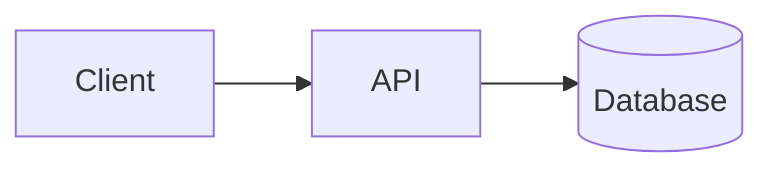
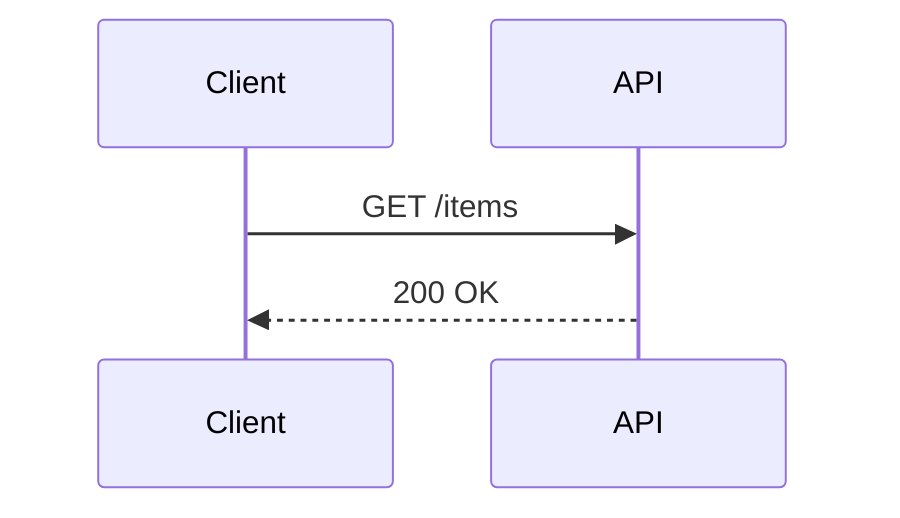

# Architecture notes

Some text before the diagram.

```mermaid
flowchart LR
    Client --> API --> DB[(Database)]
```

More text, and a second diagram:

```mermaid
sequenceDiagram
    Client->>API: GET /items
    API-->>Client: 200 OK
```

The end.
